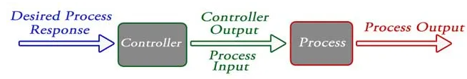
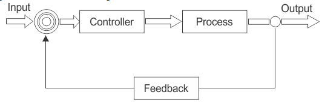

## What is Robot Control?
* In simple words, its the connection between **limbs(mechanics)** of the bot to its **brain(software)**.

* In technial terms - A system that can command, direct or regulate itself or another system to achieve a certain goal.

## Before diving in, here are some terms

* **System**: A combination or arrangement of a number of different physical components to form a whole unit such that that combining unit performs to achieve a certain goal.

* **Plant or process**: The part or component of a system that is required to be controlled.

* **Input**: It is the signal or excitation supplied to a control system.

* **Output**: It is the actual response obtained from the control system.

* **Disturbances**: The signal that has adverse effect on the performance of a control
system.

* Basically, there are two types of systems
    - Open loop systems
        - A control system in which the control action is totally independent of the output of the system.
        - Manually controlled systems are also categorised as open loop systems.
        - Such systems can been seen as in microwaves, washing machines etc, where we set the timer and that action takes place for that certain amount of time.
        
    <p align="center">
    
    <p align = "center">
    <i>open loop control</i>
    </p>  

    - Closed loop Systems
        - A control system in which the control action adjusts itself according to the output generated to acheive a certain objective.

        - The difference between open loop system and closed loop system is the **feedback** closed loop system takes from the output.

        - The feedback gives an idea about the output which is then compared with the **desired action**. the deviation in output w.r.t to desired value is **error**. The controller tries to minimize this error.

        - Such systems can be seen all around us, some are present in electric irons, geysers to maintain a fixed temprature and many more!!

    <p align="center">
    
    <p align = "center">
    <i>closed loop control</i>
    </p> 

### Feels complicated? 
Well, it'll be all worth it once you make your robots do this
- [](https://youtu.be/us_sHHnyMvQ)

- or maybe even this -  
- [](https://youtu.be/fn3KWM1kuAw)


## Installation

To get started, we'll first need a few libraries -  

1. `pip install numpy`
3. `pip install controlpy`
4. `pip install gym`

Read the documentation for control  [here](https://github.com/markwmuller/controlpy/tree/master/examples) and for gym [here](https://gym.openai.com/docs/)


Also upgrade to latest numpy `pip install numpy --upgrade`

For pybullet errors refer [here](https://github.com/Robotics-Club-IIT-BHU/Robotics-Camp-2021/tree/main/Basics%20of%20pyBullet/Week%201/Subpart%201)

## Verification

Run this sample code to verify if everything is working

```
import gym
import controlpy
import numpy as np
import pybullet_data
import pybullet as p

env = gym.make('CartPole-v0')
env.reset()
for _ in range(1000):
    env.render()
    env.step(env.action_space.sample()) # take a random action
env.close()
```