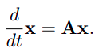
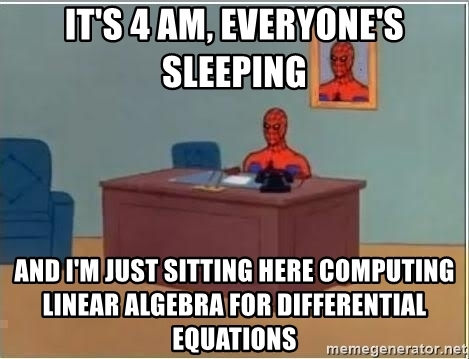
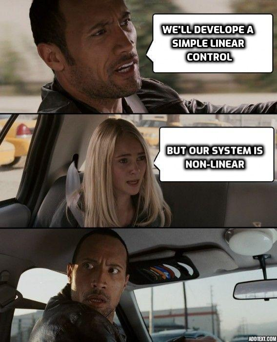
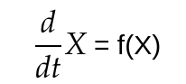

#### Let's dive a bit deeper
# Linear systems

Linear systems are those whose states are governed by Linear differential equation below

Where, A is a **NxN square matrix** representing the dynamics of the system. And x is  the **Nx1 state vector** representing the current state of the system.

The state consists of the variables that are used to define the current state of affairs of the system. eg: For a robots, it may be its current position and velocity, then Matrix A will be representing the dynamics relating the derivatives of position and velocity to their current values.

## How to form equations for a system?

Well, only few systems follow Linear characterisitcs, few others can be approximated on some conditions.

We'll get to those, first we look at one simple linear system - the spring and mass system

<i>Brings back memories...eh?</i>

The state eqution for this system can be easily derived using Newton's Laws, but with increasing complexity of the system, use of Lagrangian is preffered as it gives the dynamics eqn with relative ease. Refer [here](https://youtu.be/KpLno70oYHE).

Either way we arrive at the eqn

Note that here x reperesnts the displacement of mass from the normal position.

Taking x and <i>xdot</i> to be our states, the above eqn can be written as -

 <i> Linear equation for spring mass system</i>

## What to do with non-linear systems?
Most Real world systems are quite complex making them hard to be represented in linear forms, so we use certain methods to model them like one.

Linear or non-linear, all systems have a relation between change of stte and current state, let a non-linear system be as follows (f(x) is any non-linear function)

Now, the non-linear system can be linearized about certain fixed states given as 

Now, to linearize about the fixed state, first we need to find the jacobian matrix of f(x). Now, jacobian is a first order differential matrix which is a very important tool in robotics. We currently cannot go in depth of what jacobian is, but this is how you calculate it for a given differential equation -

So the above equation, when written in a matrix form, assuming there are two state variables x1 and x2 would be represented as -

Jacobian for this is given as- 

Then, finally to linearise a system about a fixed point, we put in the fixed state variables in the jacobian to get A matrix

Now, we can write our non-linear system as an approximated linear system about the state x(bar) represented by the equation -

Hence, we have successfully linearized a non-linear system about a fixed state.

Note- This linearization is valid only when the state of the system remains close to the fixed state. If the system diverges away from the fixed point, approximation will become invalid and the system will collapse.

Mastering Eigen Values and Eigen Vectors -

To proceed further we need some idea about eigen values and eigen vectors. So read this article about eigen values and eigen vectors - [Eigen values and Eigen vectors](https://www.mathsisfun.com/algebra/eigenvalue.html)

<i> Just keep going!! it'll be worth it. </i>

# Stability

Assuming now you might be having some idea about eignevalues and eigenvectors, we move towards stability.

**A system is said to be stable if it's state converges to zero when left undisturbed for some time, and unstable if it diverges to infinity.**

A linear system as given by above equation is said to be **stable** if **each and every eigenvalue of dynamics Matrix A has negative real part. with even one of the eigen value positive, the system is unstable and will diverge to infinity.**

With that, we know if the system is stable,it will converge to origin after some time.

But what if we want our system to converge to some other state? The ans is simple, we shift the origin ;)

<i>Modified equation</i>

That's it for stability, don't worry about calculating eigen values and stuff, all of that can be handled via math libraries.